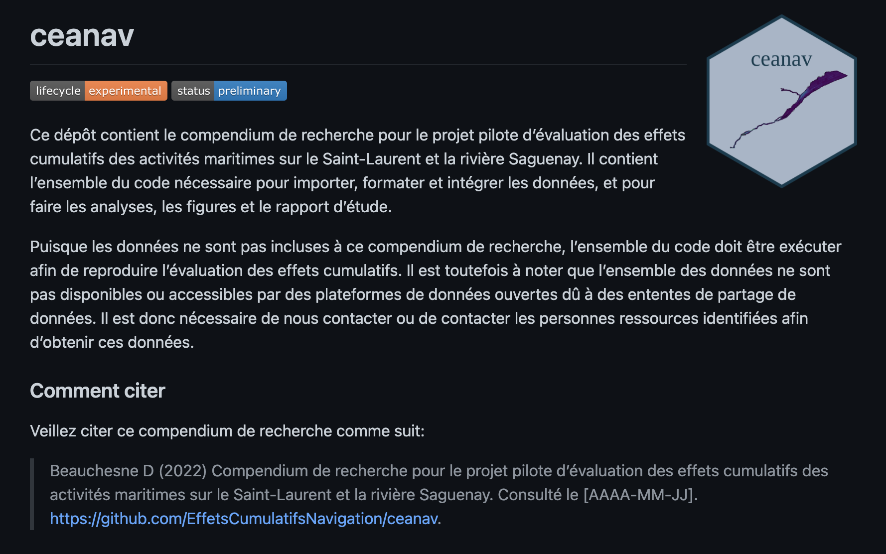

```{r setup, include=FALSE}
source('_setup.R')
# knitr::clean_cache(TRUE)
htmltools::tagList(
  xaringanExtra::use_clipboard(
    button_text = "<i class=\"fa fa-clipboard\"></i>",
    success_text = "<i class=\"fa fa-check\" style=\"color: #37abc8\"></i>",
  ),
  rmarkdown::html_dependency_font_awesome()
)
# xaringanExtra::use_scribble()

cols <- c('#777777','#d66666','#f0f518','#2eb8dd','#6a8868')
```


class: title-slide, middle


# Cumulative effects assessment of marine vessel activities in the St. Lawrence and the Saguenay River

### Pilot Projet

<center></img></center>

<center><i>David Beauchesne, Cindy Grant & Philippe Archambault</i></center>

<span class="br2"></span>

<center>
<a href="https://www.ulaval.ca/"></img></a>
&nbsp;&nbsp;&nbsp;&nbsp;&nbsp;&nbsp;&nbsp;&nbsp;&nbsp;&nbsp;
</img>
<!-- &nbsp;&nbsp;&nbsp;&nbsp;&nbsp;
</img> -->
</center>

<span class="br2"></span>

#### Presentation of final report

#### 2022-03-23

#### [**French version**](https://effetscumulatifsnavigation.github.io/2022-03-TC-webinaire_ceanav/)


---


class: inverse, center, middle

# Research team

<html><div style='float:left'></div><hr color='#ffdd55' style="margin-top:-30px" size=1px width=720px></html>


---

# Research team

<br/>

<center>
<div class="divTable team">
  <div class="divTableBody">
    <div class="divTableRow">
      <div class="divTableCell">
        
      </div>
      <div class="divTableCell">
        
      </div>
      <div class="divTableCell">
        
      </div>
    </div>
    <div class="divTableRow">
      <div class="divTableCell"><b>David Beauchesne</b></div>
      <div class="divTableCell"><b>Cindy Grant</b></div>
      <div class="divTableCell"><b>Philippe Archambault</b></div>
    </div>
  </div>
</div>
</center>


---

class: inverse, center, middle

# Cumulative effects - marine vessel activities

<html><div style='float:left'></div><hr color='#ffdd55' style="margin-top:-30px" size=1px width=720px></html>

#### Background
### Scope of assessment
### Assessment method 
### Profile 
### Results
### Limits & perspectives


---
# Background

.pull-left4[
## National initiative 

- .font90[National framework for assessing cumulative effects]
- .font90[Regional assessments (6)]

## St. Lawrence river (QC)

- .font90[Gouvernement of Canada]
- .font90[Gouvernement of Quebec]
- .font90[First Nations]
  - .font90[Huron-Wendat Nation]
  - .font90[Innu Nation of Essipit]
  - .font90[Mohawk Nation of Kahnawà:ke]
  - .font90[Wolastoqiyik Wahsipekuk Nation]
  - .font90[W8banaki Nation]
- .font90[Local stakeholders]
- .font90[Non-governmental organizations]
]

.pull-right4[
<center></img></center>

<a href='https://www.donneesquebec.ca/'></a>
<a href='https://ogsl.ca/fr/accueil/'></a> 
<a href='https://open.canada.ca/fr'></a>
]

---

class: inverse, center, middle

# Cumulative effects - marine vessel activities

<html><div style='float:left'></div><hr color='#ffdd55' style="margin-top:-30px" size=1px width=720px></html>

### Background
#### Scope of assessment
### Assessment method
### Profile 
### Results
### Limits & perspectives

---

# Scope of assessment

## General objective

*Develop an assessment method and assess the cumulative effects of marine vessel activities in the St. Lawrence (fluvial sector and estuary) and the Saguenay River (deep water section) in Quebec*

<br>

--
## Specific objectives

- Characterize the intensity and spatial distribution of marine vessel activities and the resulting targeted environmental stressors;

--
- Characterize the spatial structure of certain targeted valued components;

--
- Assess the vulnerability of valued components to the environmental stressors;

--
- Assess the cumulative effects of the environmental stressors on valued components.


---

# Scope of assessment

## Spatial and temporal scope <!-- &nbsp;&nbsp; <a href="maps/sa.html" target="_blank">`r mp()`</a> -->

.pull-left2[
#### Spatial extent

- West: Châteaugay
- East: Pointe-des-Monts and Cap-Chat
- Saguenay : Saint-Fulgence

#### Study grid

- $1km^2$ cells

#### Temporal limits

- Contemporary assessment
- ~2000-2020 depending on data availability
]

.pull-right2[
<br>
<center>
<a href="https://effetscumulatifsnavigation.github.io/Report/figures/aoi.png">
</img>
</a>
</center>
]


---

# Scope of assessment

## Environmental stressors & valued components

<br/>

<center></img></center>


--
.font80[`r tr()` Although the term ***stressor*** suggests negative effects, a stressor may have no effect, or even have positive effects, on a valued component]

---
# Scope of assessment 

## Limitations and special considerations <br><br>

&emsp;***Intrepretation constrained by the scope of the assessment*** <br>
&emsp;&emsp;&emsp;.font90[Spatial and temporal scope] <br>
&emsp;&emsp;&emsp;.font90[Environmental stressors] <br>
&emsp;&emsp;&emsp;.font90[Valued components] <br>


--
&emsp;***Regional assessment of cumulative effects*** <br>


--
&emsp;***Sectoral assessment centered on marine vessel activities*** <br>


--
&emsp;***Valued components specific to this project*** <br>


--
&emsp;***Assessment based on pre-existing data*** <br>


---

class: inverse, center, middle

# Cumulative effects - marine vessel activities

<html><div style='float:left'></div><hr color='#ffdd55' style="margin-top:-30px" size=1px width=720px></html>

### Background
### Scope of assessment
#### Assessment method
### Profile 
### Results
### Limits & perspectives

---

# Assessment method

<center></img></center>

.references[
Halpern et al. 2008; Halpern et al. 2015
]


---

# Assessment method

<center></img></center>


.references[
Halpern et al. 2008; Halpern et al. 2015
]

---

# Assessment method

<br/><br/>

<center></img></center>

.references[
Halpern et al. 2008; Halpern et al. 2015
]

---

# Assessment method

<center></img></center>

.references[
Halpern et al. 2008; Halpern et al. 2015
]

---

# Assessment method

<center></img></center>

.references[
Halpern et al. 2008; Halpern et al. 2015
]

---

class: inverse, center, middle

# Cumulative effects - marine vessel activities

<html><div style='float:left'></div><hr color='#ffdd55' style="margin-top:-30px" size=1px width=720px></html>

### Background
### Scope of assessment
### Assessment method
#### Profile 
### Results
### Limits & perspectives

---

# Profile <a href='https://github.com/EffetsCumulatifsNavigation/ceanav'></a>

## Data collection and management

--
- Existing data

--

- Engagement with collaborators

--
- Prioritizing open data
<a href='https://open.canada.ca/fr'></a>
<a href='https://ogsl.ca/fr/accueil/'></a> 
<a href='https://www.donneesquebec.ca/'></a>

--

- Data sharing agreements

--
- Transparency & reproducibility &nbsp; `r rp()` `r gh()` <a href='https://github.com/EffetsCumulatifsNavigation/ceanav'></a>
- Research compenmdium ***ceanav***
- Sharing data on the SLGO web portal .font60[`r tr()` in progress]


---
# Profile: Environmental stressors 
<!-- .font70[(25 sous-catégories)] -->

<center>
<div class="divPortrait">
  <div class="divPortraitBody">
  
    <!-- Row 1 : text -->
    <div class="divPortraitRow">
      <div class="divPortraitCell"></div>
      <div class="divPortraitTitle">
        <b>Anchorages</b> (1) &nbsp;<a href="https://effetscumulatifsnavigation.github.io/Report/portrait.html#ancrage" target="_blank">`r bk()`</a>
      </div>
      <div class="divPortraitCell"></div>
      <div class="divPortraitTitle">
        <b>Accidental spills</b> (3) &nbsp;<a href="https://effetscumulatifsnavigation.github.io/Report/portrait.html#deversement" target="_blank">`r bk()`</a>
      </div>
      <div class="divPortraitCell"></div>
      <div class="divPortraitTitle">
        <b>Dredging</b> (3) &nbsp;<a href="https://effetscumulatifsnavigation.github.io/Report/portrait.html#dragage" target="_blank">`r bk()`</a>
      </div>
    </div>
    
    <!-- Row 2: figures -->
    <div class="divPortraitRow">
      <div class="divPortraitData">0070<br>0071</div>
      <div class="divPortraitCell">
        <a href="figures/cumulative_st_ancrage.png" target="_blank">
          </img>
        </a>
      </div>
      <div class="divPortraitData">0016</div>
      <div class="divPortraitCell">
        <a href="figures/cumulative_st_deversement.png" target="_blank">
          </img>
        </a>
      </div>
      <div class="divPortraitData">0018<br>0019<br>0046<br>0048<br>0049<br>0050<br>0052<br>0069</div>
      <div class="divPortraitCell">
        <a href="figures/cumulative_st_dragage.png" target="_blank">
          </img>
        </a>      
      </div>
    </div>
    
    <!-- Row 3 : text -->
    <div class="divPortraitRow">
      <div class="divPortraitCell"></div>
      <div class="divPortraitTitle">
        <b>Shipwrecks</b> (1) &nbsp;<a href="https://effetscumulatifsnavigation.github.io/Report/portrait.html#naufrage" target="_blank">`r bk()`</a>
      </div>  
      <div class="divPortraitCell"></div>
      <div class="divPortraitTitle">
        <b>Shipping</b> (11) &nbsp;<a href="https://effetscumulatifsnavigation.github.io/Report/portrait.html#navigation" target="_blank">`r bk()`</a>
      </div>
      <div class="divPortraitCell"></div>
      <div class="divPortraitTitle">
        <b>Commercial fishing</b> (5) &nbsp;<a href="https://effetscumulatifsnavigation.github.io/Report/portrait.html#pechecommerciale" target="_blank">`r bk()`</a>
      </div>
    </div>
    
    <!-- Row 4: figures -->
    <div class="divPortraitRow">
      <div class="divPortraitData">0062</div>
      <div class="divPortraitCell">
        <a href="figures/cumulative_st_naufrage.png" target="_blank">
          </img>
        </a>      
      </div>  
      <div class="divPortraitData">0020<br>0021<br>0028<br>0041<br>0047</div>
      <div class="divPortraitCell">
        <a href="figures/cumulative_st_navigation.png" target="_blank">
          </img>
        </a>      
      </div>
      <div class="divPortraitData">0033<br>0034<br>0035</div>
      <div class="divPortraitCell">
        <a href="figures/cumulative_st_peche_commerciale.png" target="_blank">
          </img>
        </a>      
      </div>  
    </div>

    <!-- Row 5 : text -->
    <div class="divPortraitRow">
      <div class="divPortraitCell"></div>
      <div class="divPortraitCell"></div>
      <div class="divPortraitCell"></div>
      <div class="divPortraitTitle">
        <b>Marine pollution</b> (1) &nbsp;<a href="https://effetscumulatifsnavigation.github.io/Report/portrait.html#pollutionmaritime" target="_blank">`r bk()`</a>
        </div>
    </div>
    
    <!-- Row 6: figures -->
    <div class="divPortraitRow">
      <div class="divPortraitCell"></div>
      <div class="divPortraitInfo">
        `r nf()` The unique identifiers <br> are linked to the datasets <br> used (<a href="https://effetscumulatifsnavigation.github.io/Report/annexe1.html">Appendix 1</a>)
      </div>
      <div class="divPortraitData">0018,0019<br>0020,0021<br>0028,0033<br>0034,0035<br>0041,0046<br>0047,0048<br>0049,0050</div>
      <div class="divPortraitCell">
        <a href="figures/cumulative_st_pollution_maritime.png" target="_blank">
          </img>
        </a>      
      </div>
      <div class="divPortraitData">0052,0069<br>0070,0071</div>
      

  </div>
</div>
</center>


---
# Profile: Valued components 
<!-- .font70[(77 sous-catégories)] -->

<center>
<div class="divPortrait">
  <div class="divPortraitBody">
  
    <!-- Row 1 : text -->
    <div class="divPortraitRow">
      <div class="divPortraitCell"></div>
      <div class="divPortraitTitle">
        <b>Wilflife and plant habitats</b> (21) &nbsp;<a href="https://effetscumulatifsnavigation.github.io/Report/portrait.html#habitat" target="_blank">`r bk()`</a>
      </div>
      <div class="divPortraitCell"></div>
      <div class="divPortraitTitle">
        <b>Bank integrity</b> (4) &nbsp;<a href="https://effetscumulatifsnavigation.github.io/Report/portrait.html#berge" target="_blank">`r bk()`</a>
      </div>
    </div>
    
    <!-- Row 2: figures -->
    <div class="divPortraitRow">
      <div class="divPortraitData">
         0001,0002<br>
         0003,0009<br>
         0010,0013<br>
         0014,0017<br>
         0043,0053<br>
         0057,0058<br>
         0059,0060<br>
      </div>
      <div class="divPortraitCell">
        <a href="figures/cumulative_cv_habitat.png" target="_blank">
          </img>
        </a>
      </div>
      <div class="divPortraitData">0017</div>
      <div class="divPortraitCell">
        <a href="figures/cumulative_cv_berge.png" target="_blank">
          </img>
        </a>
      </div>
    </div>
    
    <!-- Row 3 : text -->
    <div class="divPortraitRow">
      <div class="divPortraitCell"></div>
      <div class="divPortraitTitle">
        <b>Marine mammals</b> (9) &nbsp;<a href="https://effetscumulatifsnavigation.github.io/Report/portrait.html#mammiferesmarins" target="_blank">`r bk()`</a>
      </div>
      <div class="divPortraitCell"></div>
      <div class="divPortraitTitle">
        <b>Areas of cultural, heritage <br>and archeological interest</b> (43) &nbsp;<a href="https://effetscumulatifsnavigation.github.io/Report/portrait.html#habitat" target="_blank">`r bk()`</a>
      </div>
    </div>
    
    <!-- Row 4: figures -->
    <div class="divPortraitRow">
      <div class="divPortraitData">0027<br>0054</div>
      <div class="divPortraitCell">
        <a href="figures/cumulative_cv_mammiferes_marins.png" target="_blank">
          </img>
        </a>      
      </div>  
      <div class="divPortraitData">
        0022,0023<br>
        0024,0025<br>
        0030,0032<br>
        0038,0039<br>
        0044,0045<br>
        0055,0066<br>
        0067,0068<br>
        0072<br>
      </div>
      <div class="divPortraitCell">
        <a href="figures/cumulative_cv_site.png" target="_blank">
          </img>
        </a>      
      </div>
    </div>

  </div>
</div>
</center>

.references[
`r nf()` The unique identifiers are linked to the datasets used (<a href="https://effetscumulatifsnavigation.github.io/Report/annexe1.html">Appendix 1</a>)
]


---

# Profile 

## Vulnerability

.references[
Halpern et al. 2007; Teck et al., 2010; Kappel et al., 2012; Maxwell et al. 2013; Clarke Murray et al., 2015a
]

.pull-left2[
### Metrics

- Spatial extent 
- Frequency
- Trophic impact
- Resistance 
- Recovery time
- Direct or indirect effect
- Effect on reproduction 
- Effect on the population 
- Species status
- Resident species
]


---

# Profile 

## Vulnerability

.references[
Halpern et al. 2007; Teck et al., 2010; Kappel et al., 2012; Maxwell et al. 2013; Clarke Murray et al., 2015a
]

.pull-left2[
### Metrics

- Spatial extent 
- Frequency
- Trophic impact
- Resistance 
- Recovery time
- Direct or indirect effect
- Effect on reproduction 
- Effect on the population 
- Species status
- Resident species

]

.pull-right2[
### Stressor - Valued component

- Score given to each metric selected
- Use of scientific literature of expert knowledge
- Sum of metric values
- Divide by the maximum value observed
- Relative vulnerability [0,1]
]

---

# Profile 

## Vulnerability .font70[(example)]

### Beluga - Containers

- *Frequency*: **persistent** (***4***/4)
- *Direct or indirect effects*: **minor direct effect** (***3***/4)
- *Resistence*: mortality **unlikely** (***1***/3)
- *Recovery time*: **10-100 years** (***3***/4)
- *Effect on reproduction*: **low** (***1***/3)
- *Effect on the population*: **individuals** (***1***/3)
- *Species status*: **endangered** (***3***/3)
- *Resident species*: **resident** (***3***/3)

***Total score: 19***

---

# Profile 

## Vulnerability .font70[(example)]

[<center></img></center>](https://effetscumulatifsnavigation.github.io/Report/figures/figures-vulnerability/mammiferes_marins.png)

---

# Profile 

## Vulnerability 

<br>

&emsp; `r nf()` *The vulnerability of natural areas comes from the literature* <br>
&emsp;&emsp;&emsp;.font80[(Kappel et al. 2012)] <br>


--
&emsp; `r nf()` The vulnerability of banks comes from a bank erosion hazards assessment <br>
&emsp;&emsp;&emsp;.font80[(Bernier et al. 2020, 2021)] <br>


--
&emsp; `r nf()` Areas of cultural, heritage and archeological interest all have a <br>
&emsp;&emsp;&emsp;maximum value of 1 <br>


---

class: inverse, center, middle

# Cumulative effects - marine vessel activities

<html><div style='float:left'></div><hr color='#ffdd55' style="margin-top:-30px" size=1px width=720px></html>

### Background
### Scope of assessment
### Assessment method
### Profile 
#### Results
### Limits & perspectives

---

# Results

## Cumulative stressors

<br2>

.pull-left2[
- Distributed in the whole study area

- Port cities and seaway

- Shipping and marine pollution widely spread

]
.pull-right2[
<br>
[<center></img></center>](https://effetscumulatifsnavigation.github.io/Report/figures/figures-output/cumulative_st.png)
]


---

# Results

## Cumulative valued components

.pull-left2[
- Distributed in the whole study area

- High diversity of valued components in coastal areas

- Lake Saint-Pierre region

- Mouth of Saguenay river
]
.pull-right2[
<br>
[<center></img></center>](https://effetscumulatifsnavigation.github.io/Report/figures/figures-output/cumulative_cv.png)
]

---

# Results

## Cumulative effects

.pull-left2[
- Generalized and varied intensity
- Fluvial sector: intense and condensed 
  - .font90[Quebec and south Île d'Orléans]
  - .font90[Lake Saint-Pierre]
  - .font90[Seaway (Montréal - Trois-Rivières)]
- Maritime sector: diffuse
  - .font90[Mouth of Saguenay river]
]
.pull-right2[
<br>
[<center></img></center>](https://effetscumulatifsnavigation.github.io/Report/figures/figures-output/cumulative_effects.png)
]

---

# Results

## Pathways of effect

.pull-left2[
- Overview of assessment
- 1358 direct pathways of effect
- Mean score: 0.11 ± 0.15 (max = 1)
]

.pull-right2[
[<center></img></center>](https://effetscumulatifsnavigation.github.io/Report/figures/figures-output/cumulative_effects_metanetwork.png)
]


---

# Results

## Regional contribution: .font90[Environmental stressors]

.pull-left2[
- .font90[Shipping and marine pollution]
- .font90[Targetted effects of commercial fishing]
]
.pull-right2[ 
- .font90[Localized effects of anchorages, accidental spills and dredging]
- .font90[Overlap in highly affected areas, *e.g.* lake Saint-Pierre]
]

[<center></img></center>](https://effetscumulatifsnavigation.github.io/Report/figures/figures-output/cumulative_effects_regional_contribution.png)

---

# Results

## Regional contribution: .font90[Valued components]

.pull-left4[
- .font90[High exposure of areas of interest, especially in fluvial sector]
- .font90[Bank integrity affected by shipping]
]
.pull-right4[ 
- .font90[Effects and sources of effects varied on habitats]
- .font90[Lesser effects on marine mammals; localized at the mouth of the Saguenay]
]

[<center></img></center>](https://effetscumulatifsnavigation.github.io/Report/figures/figures-output/cumulative_effects_regional_contribution.png)

---

# Results

## Administrative regions

.pull-left4[
- Regions of the fluvial sector more affected, particularly the Montérégie region
  - .font90[Concentration of the effects of shipping] 
  - .font90[Mainly freight transport]
- Regions of the maritime sector less affected
  - .font90[Côte Nord: marine mammals at the mouth of the Saguenay river] 
]
.pull-right4[
[<center></img></center>](https://effetscumulatifsnavigation.github.io/Report/figures/figures-output/cumulative_effects_region_cea.png)
]

---

class: inverse, center, middle

# Cumulative effects - marine vessel activities

<html><div style='float:left'></div><hr color='#ffdd55' style="margin-top:-30px" size=1px width=720px></html>

### Background
### Scope of assessment
### Assessment method
### Profile 
### Results
#### Limits & perspectives

---

# Limits & perspectives 

***Areas of cultural, heritage and archeological interest*** <br>
&emsp;&emsp;.font90[Difficulties of considering socio-cultural effects] <br>
&emsp;&emsp;.font90[*St. Lawrence Cultures et Nations* project] &nbsp; .font80[`r tr()` (Next presentation!)] <br>


--
***Regional assessment of cumulative effects*** <br>
&emsp;&emsp;.font90[Assessment does not consider all stressors affecting the study area] <br>
&emsp;&emsp;.font90[Support and inform the upcoming regional assessment in the St. Lawrence] <br>


--
***Characterizing the Saguenay river*** <br>
&emsp;&emsp;.font90[Few effects predicted in the Saguenay river due to a general lack in knowledge and data] <br>


--
***Cumulative effects hotspots*** <br>
&emsp;&emsp;.font90[Fine scale assessments in areas more affected by marine vessel activities] <br>


---

# Limits & perspectives 

***Operationalize cumulative effects assessments*** <br>
&emsp;&emsp;.font90[Adopt transparent and reproducible approaches] <br>
&emsp;&emsp;.font90[Updating the research compendium] <br>


--
***Interactive exploration of cumulative effects assessment*** <br>
&emsp;&emsp;.font90[Simplified results presented in the report] <br>
&emsp;&emsp;.font90[Interactive tools to explore assessment results] <br>


---
class: inverse, center, middle

# Acknowledgements 

<html><div style='float:left'></div><hr color='#ffdd55' style="margin-top:-30px" size=1px width=720px></html>

## Because without your work, ours would not be possible

---
# Acknowledgements 

***Every person and organization that participated to engagement sessions and webinars*** <br>


--
***First Nations that collaborated on the assessment*** <br>
&emsp;&emsp;.font90[Huron-Wendat Nation] <br>
&emsp;&emsp;.font90[Innu Nation of Essipit] <br>
&emsp;&emsp;.font90[Mohawk Nation of Kahnawà:ke] <br>
&emsp;&emsp;.font90[Wolastoqiyik Wahsipekuk Nation] <br>
&emsp;&emsp;.font90[W8banaki Nation] <br>


--
***Collaborators and organizations that exchanged and shared with our research team*** <br>


--
***Members of the St. Lawrence Action Plan*** <br>


--
***Catherine Guillemette!*** <br>


---
class: inverse, center, middle

# Thank you! 

<html><div style='float:left'></div><hr color='#ffdd55' style="margin-top:-30px" size=1px width=720px></html>


<!--
rmarkdown::render('./index.Rmd')
xaringan::decktape("https://effetscumulatifsnavigation.github.io/WebinaireMethode", "Webinaire.pdf", docker = FALSE)
-->
